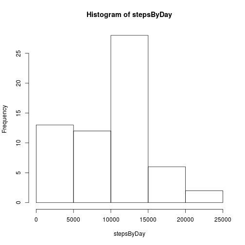
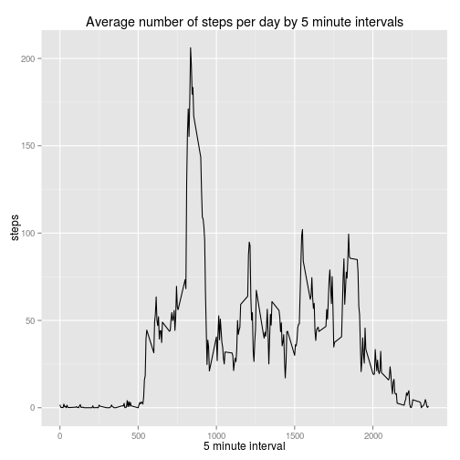
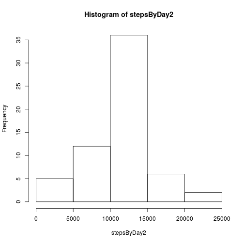
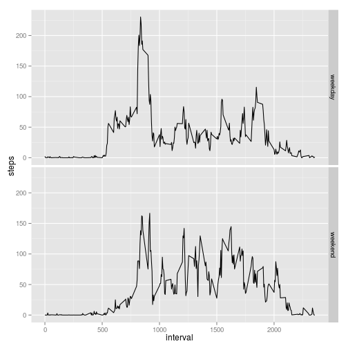

## Loading and preprocessing the data
First, we unzip the data and load it into the variable **data**

```r
unzip("activity.zip");
data <- read.csv("activity.csv", stringsAsFactors=FALSE, na.strings="NA")
```
Additionally, we transform the dates to actual date values

```r
data$date<-as.Date(data$date, format="%Y-%m-%d")
```

## What is mean total number of steps taken per day?
First, let's sum up all steps by day

```r
stepsByDay <- tapply(data$steps, data$date, sum, na.rm=T)
```

Let's take a look at the histogram of the total amount of steps by day:

```r
hist(stepsByDay)
```

 

Now, we're interested in the mean of the total steps of days

```r
meanAndMedian <- c(mean(stepsByDay), median(stepsByDay))
names(meanAndMedian) <- c("mean", "median")
```
The mean is **9354.23**, the median is **10395**

## What is the average daily activity pattern?

To evaluate the average daily activity pattern, we first have to find the average number of steps grouped by the 5 minute intervals

```r
numberOfStepsByInterval <- tapply(data$steps, data$interval, mean, na.rm=T)
```

So, let's take a look at the time plot:

```r
library(ggplot2)
ggplot(data, aes(x=interval, y=steps), na.rm=T)+stat_summary(fun.y="mean", geom="line")+xlab("5 minute interval")+ylab("steps")+ggtitle("Average number of steps per day by 5 minute intervals")
```

```
## Warning: Removed 2304 rows containing missing values (stat_summary).
```

 

```r
maximumNumberOfSteps <- numberOfStepsByInterval[which.max(numberOfStepsByInterval)]
```

So the interval **835** has the highest average with a value of **206.17**

## Imputing missing values
Since we're starting to manipulate the original data, we better copy our original data frame and check which entries have NA values

```r
manipulatedDF <- data.frame(data)
naData <- manipulatedDF[is.na(manipulatedDF$steps),]
```

In total, there are **2304** NA values in the dataset.

Let's fill in the values of the average number of steps by the specific interval.

```r
manipulatedDF[is.na(data$steps), ]$steps <- sapply(naData$interval, function(x){numberOfStepsByInterval[as.character(x)]})
```

Let's take a look which effect on the histogram and the mean and median, our manipulation had:

```r
stepsByDay2 <- tapply(manipulatedDF$steps, manipulatedDF$date, sum, na.rm=T)
hist(stepsByDay2)
```

 

```r
meanAndMedian2 <- c(mean(stepsByDay2), median(stepsByDay2))
names(meanAndMedian2) <- c("mean", "median")
```
As we can see, we have gotten a much more out-balanced histogram with a significant peak in the range of 10000 to 15000. Additionally, the mean (**10766.19**) and the median (**10766.19**) balanced out on a higher level than before (mean: 9354.23, median: 10395) . 


## Are there differences in activity patterns between weekdays and weekends?

First, categorize the measurements if they were executed on weekdays or weekends.

```r
library(lubridate)
weekdays <- as.numeric(wday(manipulatedDF$date, label = T))
manipulatedDF$weekend <- factor(weekdays==1|weekdays==7, labels=c("weekday", "weekend"))
```
Now, let's compare the activities during the weekends and the weekdays:

```r
library(ggplot2)
ggplot(manipulatedDF, aes(x=interval, y=steps))+facet_grid(weekend~.)+stat_summary(fun.y="mean", geom="line")
```

 

It seems like activity on weekends starts a little later than during weekdays and is distributed more evenly over the day...
